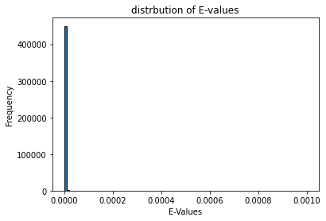
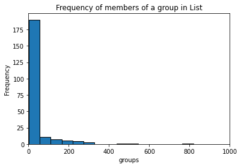
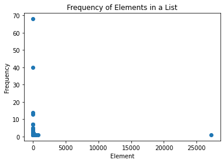
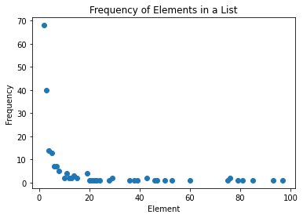

*STEEN'S LAB*\
codes by: kami

# Part one : diamond blast between two protein datasets


# step 1: download and install diamond blast on CARC
how to do a simple diamond blast on CARC and also how to read the output


## downloading the tool
you dont need to download it any more.

find it at /home1/kkalhor/important_basic_files/diamond_blast/diamond --help
```
wget http://github.com/bbuchfink/diamond/releases/download/v2.1.10/diamond-linux64.tar.gz
tar xzf diamond-linux64.tar.gz
```

# creating a diamond-formatted database file
```
/home1/kkalhor/important_basic_files/diamond_blast/diamond makedb --in reference.fasta -d reference
```

# running a search in blastp mode
```
/home1/kkalhor/important_basic_files/diamond_blast/diamond  blastp -d reference -q queries.fasta -o matches.tsv
```

# running a search in blastx mode
```
/home1/kkalhor/important_basic_files/diamond_blast/diamond  blastx -d reference -q reads.fasta -o matches.tsv
```

# downloading and using a BLAST database
```
update_blastdb.pl --decompress --blastdb_version 5 swissprot
/home1/kkalhor/important_basic_files/diamond_blast/diamond  prepdb -d swissprot
/home1/kkalhor/important_basic_files/diamond_blast/diamond  blastp -d swissprot -q queries.fasta -o matches.tsv
```


# PART TWO: Pythonic Probing: A Whimsical Dive into Oceanic Protein Data Analysis


# what bit-score and e-value is good in blast?

The Bit-Score and E-Value in BLAST (Basic Local Alignment Search Tool) are two measures that are used to evaluate the significance of a sequence alignment.

The Bit-Score is a log-based score that measures the strength of the alignment, with higher scores indicating a more significant match.

The E-Value is a statistical measure of the expectation of the number of matches at random that would have a Bit-Score equal to or greater than the one observed in the alignment. A lower E-Value indicates a more significant match, as it is less likely to have occurred by chance.

A good Bit-Score and E-Value depend on the context of the search and the desired level of sensitivity and specificity. Generally, a Bit-Score of 50 or higher and an E-Value of 1e-3 or lower are considered to be strong matches, while a Bit-Score of 30 or higher and an E-Value of 1e-5 or lower are considered to be significant matches. However, these thresholds can vary depending on the size and complexity of the database being searched and the length and similarity of the query sequence.

# what bit-score and e-value i choosed as my thereshold in my blast?
E-values equal or lower than 1e-5


step 1: importing data


```python
import pandas as pd
header_names = ["query_sequence_ID", "subject_sequence_ID", "pident", "length", "mismatch", "gapopen", "qstart", "qend", "sstart", "send", "E_value", "Bit_Score"]
df = pd.read_csv("diamond/output/directory/matches.tsv", sep="\t",names=header_names)
```

### what are these header mean in diamond output? 
query_sequence_ID: The query sequence identifier.\
subject_sequence_ID: The subject sequence identifier.\
pident: The percentage of identical matches.\
length: The length of the alignment.\
mismatch: The number of mismatches in the alignment.\
gapopen: The number of gap openings in the alignment.\
qstart: The start position of the query sequence in the alignment.\
qend: The end position of the query sequence in the alignment.\
sstart: The start position of the subject sequence in the alignment.\
send: The end position of the subject sequence in the alignment.\
evalue: The expectation value of the alignment.\
bitscore: The Bit-Score of the alignment.\

the calculation below show that 28154 unique query_sequence_ID we have in our dataframe.\
it means that all the queries found a match in our reference and most of them have multiple matches.


```python
print('number of matched is:                  ', len(list(df['query_sequence_ID'])))
print('number of unique query_sequence_ID is: ', len(set(df['query_sequence_ID'])), '   which is equal to number of proteins in sample')

```

    number of matched is:                   600900
    number of unique query_sequence_ID is:  28154    which is equal to number of proteins in sample


step 4: checking the distribution of E-values

first lets plot the E_values


```python
import matplotlib.pyplot as plt

E_values = list(df['E_value'])

plt.hist(E_values, bins=100, edgecolor='black')
plt.xlabel('E-Values')
plt.ylabel('Frequency')
plt.title('distrbution of E-values')

plt.show()

```


    

    


- in histogram above you can see most matches have the E-value near Zero\
- the maximum E-value is 0.000999 and the minimum E-value is 0.0

in the analysis below you can see the quartiles of the E-values.


```python

import statistics
statistics.mean(E_values)
quartiles = statistics.quantiles(E_values, n=4)
print(quartiles)
```

    [6.4700000000000005e-75, 1.1299999999999999e-41, 4.32e-22]


step 5: here i will filter all the matches under my thereshold which is 1e-5

okay, so lets remove some of the rows with not enough good E-values, the threshold is 1e-5


```python
import pandas as pd

df = df[df['E_value'] <= 1e-5]

sets = list(zip(df['query_sequence_ID'], df['subject_sequence_ID']))

list_of_sets = []
for k in sets:
    list_of_sets.append(set(k))


```


```python
###### important ###### dont forget to remove this line kami
# for test
# list_of_sets = list_of_sets[0:1000]
```

step 6: time consuming categorizing step


```python
# we perform this function to union the sets that have intersection
def if_intersection_then_union(set1, set2):
    if set1.intersection(set2):
        union = set1 | set2
    else:
        union = {}
    return union


# we perform the next code to remove duplicated sets
# input of function is a list of sets and this code removes the duplicated sets in our list
def remove_duplicated_sets(list_of_sets):
    unique_list = set()
    for s in list_of_sets:
        unique_list.add(frozenset(s))

    unique_list = [set(s) for s in unique_list]
    return unique_list

# this function is the combination of two above functions
def categorizing_proteins(list_of_sets):
    the_range = len(list_of_sets)
    for i in range(0,the_range):
        for j in range(0,the_range):
            union = if_intersection_then_union(list_of_sets[i], list_of_sets[j])
            if union != {}:
                list_of_sets[i] = union
                list_of_sets[j] = union
    list_of_sets = remove_duplicated_sets(list_of_sets)
    return list_of_sets


# this next code is REALLY time consuming so we break it to multiple tasks
# list_of_sets = categorizing_proteins(list_of_sets)

```

this step is performed just to reduce the computational costs


```python


def make_small_first_then(slice_length, list_of_sets):
    sub_list_of_sets = []
    # this should change to 10000
    for slice_index in range (0,len(list_of_sets)):
        if slice_index%slice_length == 0:
            start = slice_index
            end = slice_index + slice_length
            sub_list_of_sets = sub_list_of_sets + categorizing_proteins(list_of_sets[start:end])

    print('lenght of sublist is: ', len(sub_list_of_sets))
    return sub_list_of_sets


```


```python
import random
for i in range(0,10000000):
    sub_list_of_sets = make_small_first_then(1000,list_of_sets)
    if len(list_of_sets) == len(sub_list_of_sets):
        break
    list_of_sets = sub_list_of_sets
    sub_list_of_sets = random.shuffle(sub_list_of_sets)
```

    lenght of sublist is:  339393
    lenght of sublist is:  305492
    lenght of sublist is:  272347
    lenght of sublist is:  240108
    lenght of sublist is:  208779
    lenght of sublist is:  178389
    lenght of sublist is:  148931
    lenght of sublist is:  121086
    lenght of sublist is:  95728
    lenght of sublist is:  73036
    lenght of sublist is:  53461
    lenght of sublist is:  37472
    lenght of sublist is:  24630
    lenght of sublist is:  14892
    lenght of sublist is:  7985
    lenght of sublist is:  3718
    lenght of sublist is:  1445
    lenght of sublist is:  528
    lenght of sublist is:  224
    lenght of sublist is:  224


at last step we want to perform the last set making\
again this step will be time consuming and we have to do it!\
i tried so many ways but failed


```python
list_of_sets = categorizing_proteins(list_of_sets)
```

now we need to save the result as pickle list


```python
import pickle
# save the list to a file
with open("directory_for_diamond/smallest_list_of_setss_10e5.pickle", "wb") as f:
    pickle.dump(list_of_sets, f)
```


```python
import pickle
# later, you can load the list from the file
with open("directory_for_diamond/smallest_list_of_setss_10e5.pickle", "rb") as f:
    list_of_sets = pickle.load(f)
```

now let have some analysis


```python
lenghts_list = []
for i in list_of_sets:
    lenghts_list.append(len(i))

import matplotlib.pyplot as plt


plt.hist(lenghts_list, bins=500, edgecolor='black')
plt.xlabel('groups')
plt.ylabel('Frequency')
plt.title('Frequency of members of a group in List')
plt.xlim(0, 1000)  # specify the desired x-axis range
plt.show()

```


    

    


in this code you can see, most of groups are couple proteins (i mean two similar proteins)


```python
import statistics


print('minimum is : ' , min(lenghts_list))
quartiles = statistics.quantiles(lenghts_list, n=4)
print('first quartile is: ', quartiles[0])
print('median is: ', statistics.median(lenghts_list))
print('third quartile is: ', quartiles[2])
print('maximum is : ' , max(lenghts_list))
```

    minimum is :  2
    first quartile is:  2.0
    median is:  4.0
    third quartile is:  15.0
    maximum is :  27241


in this code we want to see frequency of protein sets lenght


```python
frequency_dict = {}
for item in lenghts_list:
    if item in frequency_dict:
        frequency_dict[item] += 1
    else:
        frequency_dict[item] = 1

sorted_dict = sorted(frequency_dict.items(), key=lambda x: x[0])
print(sorted_dict)

```

    [(2, 68), (3, 40), (4, 14), (5, 13), (6, 7), (7, 7), (8, 5), (10, 2), (11, 4), (12, 2), (13, 2), (14, 3), (15, 2), (19, 4), (20, 1), (21, 1), (22, 1), (23, 1), (24, 1), (28, 1), (29, 2), (36, 1), (38, 1), (39, 1), (43, 2), (46, 1), (47, 1), (50, 1), (53, 1), (60, 1), (75, 1), (76, 2), (79, 1), (81, 1), (85, 1), (93, 1), (97, 1), (109, 2), (118, 1), (130, 1), (135, 1), (139, 1), (152, 1), (158, 1), (159, 1), (175, 1), (193, 1), (201, 1), (204, 1), (216, 1), (247, 1), (248, 1), (251, 1), (262, 1), (306, 1), (314, 1), (316, 1), (463, 1), (512, 1), (792, 1), (27241, 1)]


this plot shows


```python
import matplotlib.pyplot as plt


x = list(frequency_dict.keys())
y = list(frequency_dict.values())

plt.scatter(x, y)
plt.xlabel("Element")
plt.ylabel("Frequency")
plt.title("Frequency of Elements in a List")
plt.show()

```


    

    


let zoom into this plot and see what is there clearly


```python
#remove values highr than
high_limit = 100

frequency_dict_zoom = {k: v for k, v in frequency_dict.items() if k <= high_limit}


import matplotlib.pyplot as plt


x = list(frequency_dict_zoom.keys())
y = list(frequency_dict_zoom.values())

plt.scatter(x, y)
plt.xlabel("Element")
plt.ylabel("Frequency")
plt.title("Frequency of Elements in a List")
plt.show()

```


    

    


now lets see if any set is a single protein family or not( it should be )


```python
list_of_sets[43]
```


    {'SRR7066493_k141_1796872_1',
     'SRR7066493_k141_1972148_1',
     'SRR7066493_k141_3161307_1',
     'SRR7066493_k141_3246752_2'}


```python
a_set = list(list_of_sets[43])


import pandas as pd

SRR = 'SRR7066493'
#the wired thing is that we have two dbCAN output files and one of them is bigger
# using SRR7066493_dbcan_p.tsv
df = pd.read_csv('tylor_output_data/' + SRR+ '_dbcan.tsv', sep='\t', names=['family', 'column2', 'sequence', 'column4', 'column5', 'column6', 'column7', 'column8', 'column9', 'column10' ])
# using SRR7066493_dbcan.tsv
#df = pd.read_csv('tylor_output_data/' + SRR+ '_dbcan_p.tsv', sep='\t', names=['family', 'sequence'])

# print(df)


df = df[df['sequence'].isin(a_set)]
main_df = df

df = df['family']
# function to remove numbers from categories
def remove_numbers(string):
    string = string.replace('.hmm','')
    return ''.join(c for c in string if not c.isdigit())


main_gene_families_list = []
for gene_family in df:
    gene_family = remove_numbers(gene_family).replace('_',' ')
    if str(gene_family)[-1] == ' ':
        gene_family = gene_family[0:-1]
    main_gene_families_list.append(gene_family)


# frequency of main gene families
def count_frequency(lst):
    frequency = {}
    for item in lst:
        if item in frequency:
            frequency[item] += 1
        else:
            frequency[item] = 1
    return frequency

lst = main_gene_families_list
frequency_dict = count_frequency(lst)


def sort_dict_by_value(dictionary):
    return {k: v for k, v in sorted(dictionary.items(), key=lambda item: item[1],reverse=True)}

frequency_dict = sort_dict_by_value(frequency_dict)
for key, value in frequency_dict.items():
    print(f"{key} appears {value} times")
```


    ---------------------------------------------------------------------------

    NameError                                 Traceback (most recent call last)

    <ipython-input-8-39e5c8e91959> in <module>
    ----> 1 a_set = list(list_of_sets[43])
          2 
          3 
          4 
          5 import pandas as pd


    NameError: name 'list_of_sets' is not defined


```python
len(list_of_sets)
```


    224


```python

```


<div>
<style scoped>
    .dataframe tbody tr th:only-of-type {
        vertical-align: middle;
    }

    .dataframe tbody tr th {
        vertical-align: top;
    }

    .dataframe thead th {
        text-align: right;
    }
</style>
<table border="1" class="dataframe">
  <thead>
    <tr style="text-align: right;">
      <th></th>
      <th>family</th>
      <th>column2</th>
      <th>sequence</th>
      <th>column4</th>
      <th>column5</th>
      <th>column6</th>
      <th>column7</th>
      <th>column8</th>
      <th>column9</th>
      <th>column10</th>
    </tr>
  </thead>
  <tbody>
    <tr>
      <th>0</th>
      <td>GH24.hmm</td>
      <td>137</td>
      <td>SRR7066492_k141_1000132_1</td>
      <td>110</td>
      <td>3.300000e-19</td>
      <td>3</td>
      <td>109</td>
      <td>3</td>
      <td>108</td>
      <td>0.773723</td>
    </tr>
    <tr>
      <th>1</th>
      <td>GH43_22.hmm</td>
      <td>209</td>
      <td>SRR7066492_k141_1000153_1</td>
      <td>120</td>
      <td>3.900000e-19</td>
      <td>51</td>
      <td>152</td>
      <td>1</td>
      <td>94</td>
      <td>0.483254</td>
    </tr>
    <tr>
      <th>2</th>
      <td>PL35.hmm</td>
      <td>179</td>
      <td>SRR7066492_k141_1000179_1</td>
      <td>78</td>
      <td>1.100000e-21</td>
      <td>100</td>
      <td>174</td>
      <td>3</td>
      <td>77</td>
      <td>0.413408</td>
    </tr>
    <tr>
      <th>3</th>
      <td>PL35.hmm</td>
      <td>179</td>
      <td>SRR7066492_k141_1000179_2</td>
      <td>133</td>
      <td>1.400000e-39</td>
      <td>2</td>
      <td>83</td>
      <td>50</td>
      <td>133</td>
      <td>0.452514</td>
    </tr>
    <tr>
      <th>4</th>
      <td>GH29.hmm</td>
      <td>346</td>
      <td>SRR7066492_k141_100023_1</td>
      <td>210</td>
      <td>1.700000e-37</td>
      <td>109</td>
      <td>264</td>
      <td>2</td>
      <td>153</td>
      <td>0.447977</td>
    </tr>
    <tr>
      <th>...</th>
      <td>...</td>
      <td>...</td>
      <td>...</td>
      <td>...</td>
      <td>...</td>
      <td>...</td>
      <td>...</td>
      <td>...</td>
      <td>...</td>
      <td>...</td>
    </tr>
    <tr>
      <th>28376</th>
      <td>CE19.hmm</td>
      <td>332</td>
      <td>SRR7066493_k141_999384_1</td>
      <td>153</td>
      <td>2.300000e-39</td>
      <td>145</td>
      <td>288</td>
      <td>1</td>
      <td>151</td>
      <td>0.430723</td>
    </tr>
    <tr>
      <th>28377</th>
      <td>GT51.hmm</td>
      <td>177</td>
      <td>SRR7066493_k141_999426_1</td>
      <td>135</td>
      <td>4.400000e-23</td>
      <td>112</td>
      <td>177</td>
      <td>1</td>
      <td>66</td>
      <td>0.367232</td>
    </tr>
    <tr>
      <th>28378</th>
      <td>GH168.hmm</td>
      <td>277</td>
      <td>SRR7066493_k141_999614_1</td>
      <td>188</td>
      <td>5.400000e-52</td>
      <td>108</td>
      <td>277</td>
      <td>1</td>
      <td>170</td>
      <td>0.610108</td>
    </tr>
    <tr>
      <th>28379</th>
      <td>GT2_Glycos_transf_2.hmm</td>
      <td>170</td>
      <td>SRR7066493_k141_999669_1</td>
      <td>170</td>
      <td>3.500000e-23</td>
      <td>1</td>
      <td>157</td>
      <td>9</td>
      <td>166</td>
      <td>0.917647</td>
    </tr>
    <tr>
      <th>28380</th>
      <td>GT2_Glycos_transf_2.hmm</td>
      <td>170</td>
      <td>SRR7066493_k141_999875_1</td>
      <td>113</td>
      <td>8.300000e-30</td>
      <td>1</td>
      <td>101</td>
      <td>9</td>
      <td>112</td>
      <td>0.588235</td>
    </tr>
  </tbody>
</table>
<p>36394 rows × 10 columns</p>
</div>


```python
for i in range(0,224):
    a_set = list(list_of_sets[i])
    print(i)


    import pandas as pd

    SRR = 'SRR7066493'
    #the wired thing is that we have two dbCAN output files and one of them is bigger
    # using SRR7066493_dbcan_p.tsv
    df1 = pd.read_csv('tylor_output_data/' + 'SRR7066492'+ '_dbcan.tsv', sep='\t', names=['family', 'column2', 'sequence', 'column4', 'column5', 'column6', 'column7', 'column8', 'column9', 'column10' ])
    df2 = pd.read_csv('tylor_output_data/' + 'SRR7066493'+ '_dbcan.tsv', sep='\t', names=['family', 'column2', 'sequence', 'column4', 'column5', 'column6', 'column7', 'column8', 'column9', 'column10' ])
    df = pd.concat([df1, df2])
    # using SRR7066493_dbcan.tsv
    #df = pd.read_csv('tylor_output_data/' + SRR+ '_dbcan_p.tsv', sep='\t', names=['family', 'sequence'])

    # print(df)


    df = df[df['sequence'].isin(a_set)]
    main_df = df

    df = df['family']
    # function to remove numbers from categories
    def remove_numbers(string):
        string = string.replace('.hmm','')
        return ''.join(c for c in string if not c.isdigit())


    main_gene_families_list = []
    for gene_family in df:
        gene_family = remove_numbers(gene_family).replace('_',' ')
        if str(gene_family)[-1] == ' ':
            gene_family = gene_family[0:-1]
        main_gene_families_list.append(gene_family)


    # frequency of main gene families
    def count_frequency(lst):
        frequency = {}
        for item in lst:
            if item in frequency:
                frequency[item] += 1
            else:
                frequency[item] = 1
        return frequency

    lst = main_gene_families_list
    frequency_dict = count_frequency(lst)


    def sort_dict_by_value(dictionary):
        return {k: v for k, v in sorted(dictionary.items(), key=lambda item: item[1],reverse=True)}

    frequency_dict = sort_dict_by_value(frequency_dict)
    for key, value in frequency_dict.items():
        print(f"{key} appears {value} times")

    print('+++++++++++++++++++++++++++++++')
    print('===============================')
```

    0
    GH appears 4 times
    +++++++++++++++++++++++++++++++
    ===============================
    1
    GH appears 7 times
    +++++++++++++++++++++++++++++++
    ===============================
    2
    GT appears 15 times
    +++++++++++++++++++++++++++++++
    ===============================
    3
    GH appears 135 times
    +++++++++++++++++++++++++++++++
    ===============================
    4
    GH appears 2 times
    +++++++++++++++++++++++++++++++
    ===============================
    5
    GT appears 39 times
    +++++++++++++++++++++++++++++++
    ===============================
    6
    GT appears 2 times
    +++++++++++++++++++++++++++++++
    ===============================
    222
    GT appears 2 times
    +++++++++++++++++++++++++++++++
    ===============================
    223
    GH appears 5 times
    CBM appears 2 times
    +++++++++++++++++++++++++++++++
    ===============================


```python
list_of_sets[223]
```


    {'SRR7066492_k141_180964_1',
     'SRR7066493_k141_1229800_1',
     'SRR7066493_k141_2187722_1',
     'SRR7066493_k141_2798256_1',
     'SRR7066493_k141_2852300_1',
     'SRR7066493_k141_3057455_2',
     'SRR7066493_k141_812894_1'}


SRR7066492_k141_180964_1 --> SRR7066493_k141_3057455_2 , #SRR7066493_k141_2187722_1

SRR7066493_k141_1229800_1 --> SRR7066493_k141_812894_1 ,   ##SRR7066493_k141_2852300_1

SRR7066493_k141_2798256_1 --> #SRR7066493_k141_2187722_1 , ##SRR7066493_k141_2852300_1


```bash
%%bash
cd tylor_output_data
cat SRR7066492_dbcan.tsv SRR7066493_dbcan.tsv > combined_file.tsv
# grep SRR7066492_k141_180964_1 combined_file.tsv
# grep SRR7066493_k141_3057455_2 combined_file.tsv
# grep SRR7066493_k141_2187722_1 combined_file.tsv
# grep SRR7066493_k141_2852300_1 combined_file.tsv
# grep SRR7066493_k141_2798256_1 combined_file.tsv


# grep SRR7066493_k141_1229800_1 combined_file.tsv
# grep SRR7066493_k141_812894_1 combined_file.tsv

rm combined_file.tsv
```

    CBM35.hmm	119	SRR7066493_k141_1229800_1	380	4.8e-30	2	119	145	259	0.983193277310924


# finally

how can two proteins from two families be together in a blast?????
it took nearly three days for me to find it!!!!!!!
