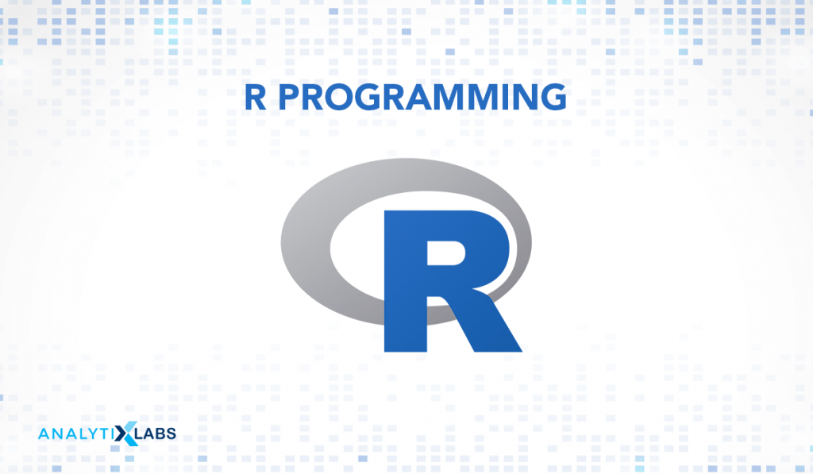

*STEEN'S LAB*\
codes by: kami

# Part one : diamond blast between two protein datasets


# step 1: download and install diamond blast on CARC
how to do a simple diamond blast on CARC and also how to read the output


## downloading the tool
you dont need to download it any more.

find it at /home1/kkalhor/important_basic_files/diamond_blast/diamond --help
```
wget http://github.com/bbuchfink/diamond/releases/download/v2.1.10/diamond-linux64.tar.gz
tar xzf diamond-linux64.tar.gz
```

# creating a diamond-formatted database file
```
/home1/kkalhor/important_basic_files/diamond_blast/diamond makedb --in reference.fasta -d reference
```

# running a search in blastp mode
```
/home1/kkalhor/important_basic_files/diamond_blast/diamond  blastp -d reference -q queries.fasta -o matches.tsv
```

# running a search in blastx mode
```
/home1/kkalhor/important_basic_files/diamond_blast/diamond  blastx -d reference -q reads.fasta -o matches.tsv
```

# downloading and using a BLAST database
```
update_blastdb.pl --decompress --blastdb_version 5 swissprot
/home1/kkalhor/important_basic_files/diamond_blast/diamond  prepdb -d swissprot
/home1/kkalhor/important_basic_files/diamond_blast/diamond  blastp -d swissprot -q queries.fasta -o matches.tsv
```


# PART TWO: R: Analysing the blast output using R


```
install.packages("ggplot2", lib = "/home1/kkalhor/important_basic_files/R_packages")
install.packages("readr", lib = "/home1/kkalhor/important_basic_files/R_packages")

library(ggplot2, lib.loc="/home1/kkalhor/important_basic_files/R_packages")
library(readr, lib.loc="/home1/kkalhor/important_basic_files/R_packages")


# Define column names
header_names <- c("query_sequence_ID", "subject_sequence_ID", "pident", "length", "mismatch",
                  "gapopen", "qstart", "qend", "sstart", "send", "E_value", "Bit_Score")

# Read the data
df <- read_tsv("matches.tsv", col_names = header_names)

# Create the plot
evalue_plot <- ggplot(df, aes(x = E_value)) +
  geom_histogram(binwidth = 0.1, fill = "blue", color = "black") +
  labs(title = "Distribution of E-values", x = "E-value", y = "Frequency") +
  theme_minimal()

# Save the plot as a PNG
ggsave("evalue_distribution.png", plot = evalue_plot, width = 8, height = 6, dpi = 300)
```


# PART TWO: Pythonic Probing: Analysing the blast output using python


# what bit-score and e-value is good in blast?

The Bit-Score and E-Value in BLAST (Basic Local Alignment Search Tool) are two measures that are used to evaluate the significance of a sequence alignment.

The Bit-Score is a log-based score that measures the strength of the alignment, with higher scores indicating a more significant match.

The E-Value is a statistical measure of the expectation of the number of matches at random that would have a Bit-Score equal to or greater than the one observed in the alignment. A lower E-Value indicates a more significant match, as it is less likely to have occurred by chance.

A good Bit-Score and E-Value depend on the context of the search and the desired level of sensitivity and specificity. Generally, a Bit-Score of 50 or higher and an E-Value of 1e-3 or lower are considered to be strong matches, while a Bit-Score of 30 or higher and an E-Value of 1e-5 or lower are considered to be significant matches. However, these thresholds can vary depending on the size and complexity of the database being searched and the length and similarity of the query sequence.

# what bit-score and e-value i choosed as my thereshold in my blast?
E-values equal or lower than 1e-5


step 1: importing data


```python
import pandas as pd
header_names = ["query_sequence_ID", "subject_sequence_ID", "pident", "length", "mismatch", "gapopen", "qstart", "qend", "sstart", "send", "E_value", "Bit_Score"]
df = pd.read_csv("diamond/output/directory/matches.tsv", sep="\t",names=header_names)
```

### what are these header mean in diamond output? 
query_sequence_ID: The query sequence identifier.\
subject_sequence_ID: The subject sequence identifier.\
pident: The percentage of identical matches.\
length: The length of the alignment.\
mismatch: The number of mismatches in the alignment.\
gapopen: The number of gap openings in the alignment.\
qstart: The start position of the query sequence in the alignment.\
qend: The end position of the query sequence in the alignment.\
sstart: The start position of the subject sequence in the alignment.\
send: The end position of the subject sequence in the alignment.\
evalue: The expectation value of the alignment.\
bitscore: The Bit-Score of the alignment.\

the calculation below show that 28154 unique query_sequence_ID we have in our dataframe.\
it means that all the queries found a match in our reference and most of them have multiple matches.


```python
print('number of matched is:                  ', len(list(df['query_sequence_ID'])))
print('number of unique query_sequence_ID is: ', len(set(df['query_sequence_ID'])), '   which is equal to number of proteins in sample')

```

    number of matched is:                   600900
    number of unique query_sequence_ID is:  28154    which is equal to number of proteins in sample


step 4: checking the distribution of E-values

first lets plot the E_values


```python
import matplotlib.pyplot as plt

E_values = list(df['E_value'])

plt.hist(E_values, bins=100, edgecolor='black')
plt.xlabel('E-Values')
plt.ylabel('Frequency')
plt.title('distrbution of E-values')

plt.show()

```


    

    


- in histogram above you can see most matches have the E-value near Zero\
- the maximum E-value is 0.000999 and the minimum E-value is 0.0

